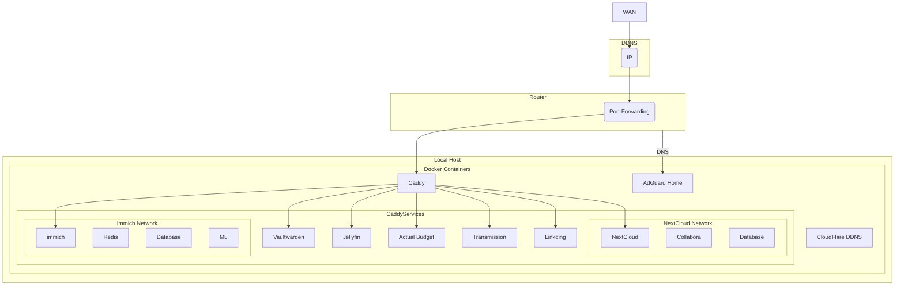

## Install

Each application can be set up by running the `init.sh` script contained in each directory: the script will delete and re-create the containers maintaining the data stored in mount binds and, if present, it will restore the database backup.

For convenience, the user can run `init-all.sh` script to set up every application contained in this repository.

## Backup

Before backing up the whole directory, the user should run `pre-backup-all.sh` script which, depending on the application, will put the containers in the right mode and eventually dump the database.

Once the backup is complete, the user should run `post-backup-all.sh` script to restore the normal functionality.

