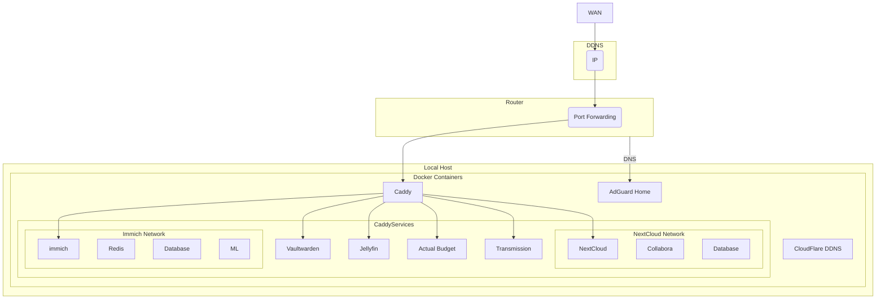

```mermaid
graph TD
  subgraph DDNS
    ddns(IP)
  end
  subgraph Router
    portForwarding(Port Forwarding)
  end

  subgraph Local Host
    subgraph Docker Containers
      caddy[Caddy]
      adguard-home[AdGuard Home]
      cloudflare-ddns[CloudFlare DDNS]
      subgraph CaddyServices
        vaultwarden[Vaultwarden]
        jellyfin[Jellyfin]
        actual[Actual Budget]
        transmission[Transmission]
        subgraph NextCloud Network
            nextcloud[NextCloud]
            nextcloud-code[Collabora]
            nextcloud-db[Database]
        end
        subgraph Immich Network
            immich[immich]
            immich-redis[Redis]
            immich-db[Database]
            immich-ml[ML]
        end
      end
    end
  end

  WAN --> ddns
  ddns --> portForwarding
  portForwarding --> caddy
  Router --DNS--> adguard-home
  caddy --> vaultwarden
  caddy --> jellyfin
  caddy --> nextcloud
  caddy --> actual
  caddy --> immich
  caddy --> transmission
```
